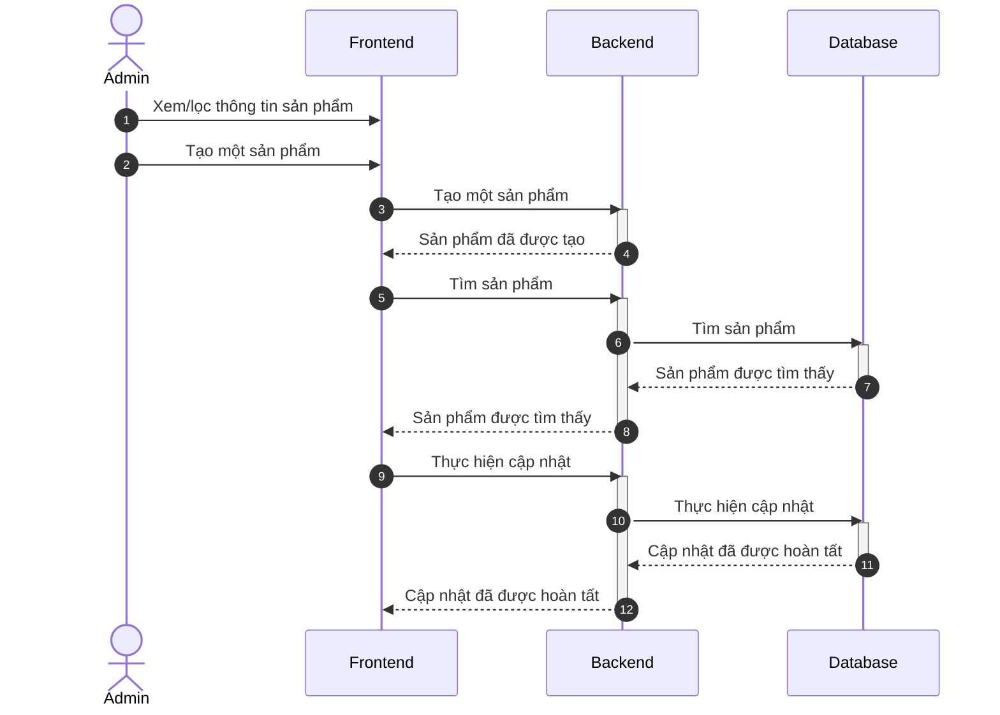
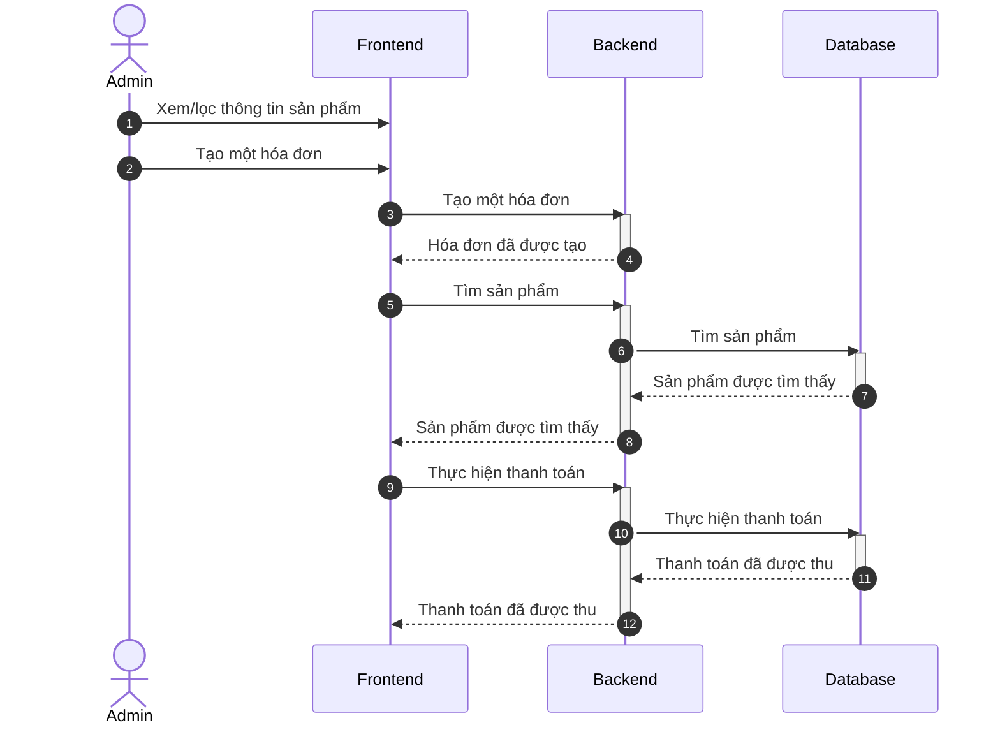
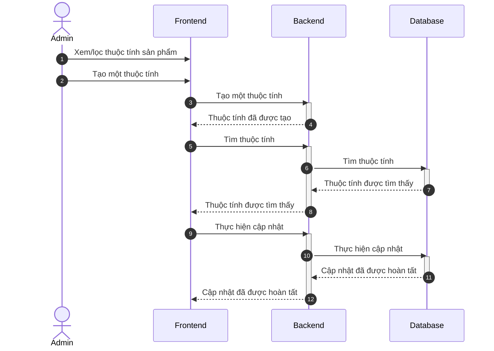
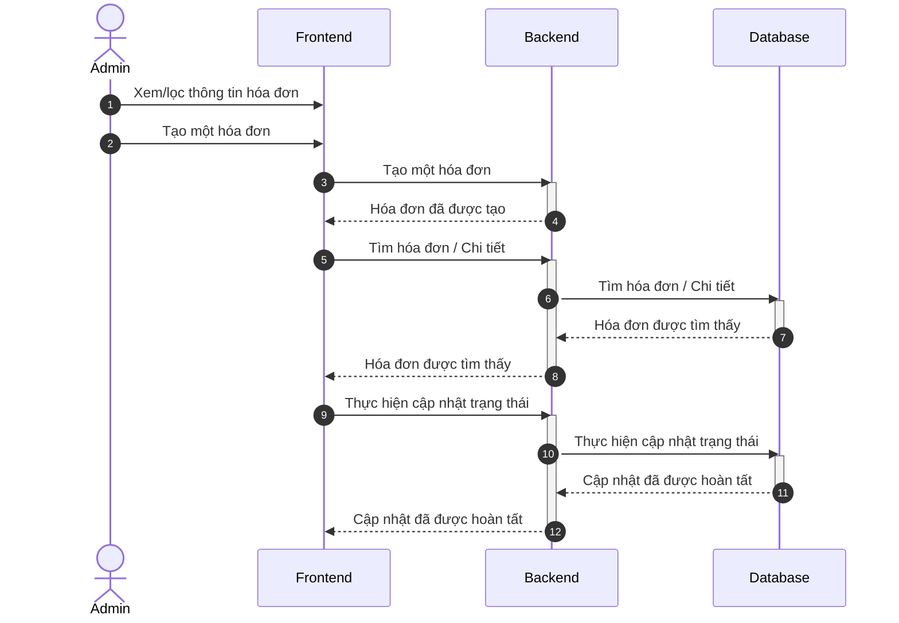
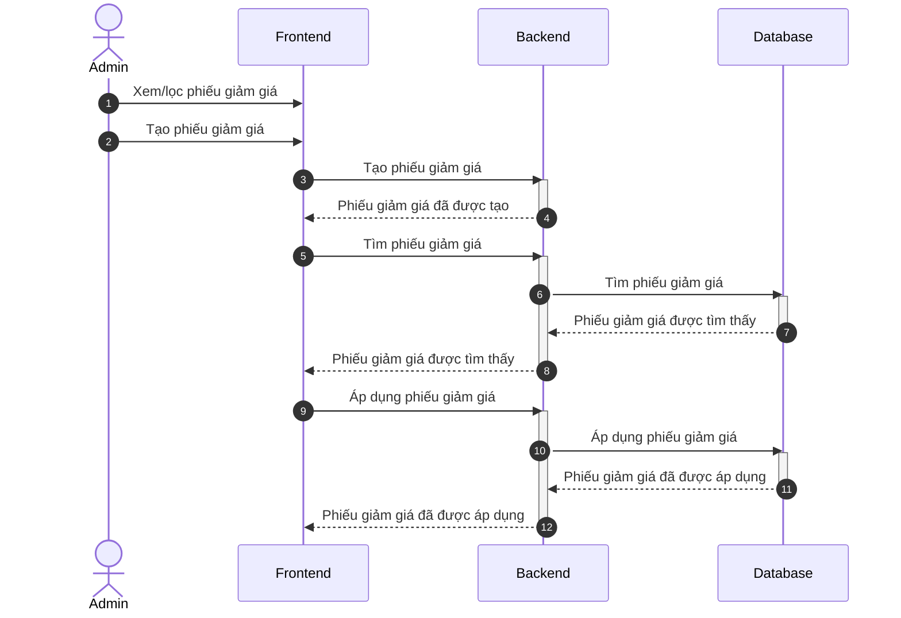
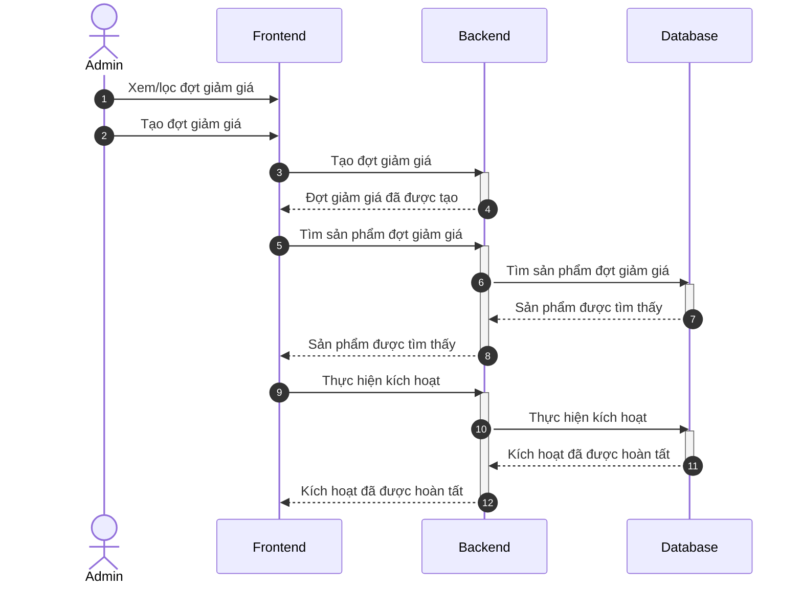
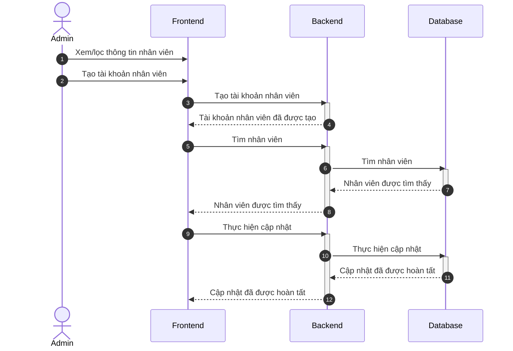
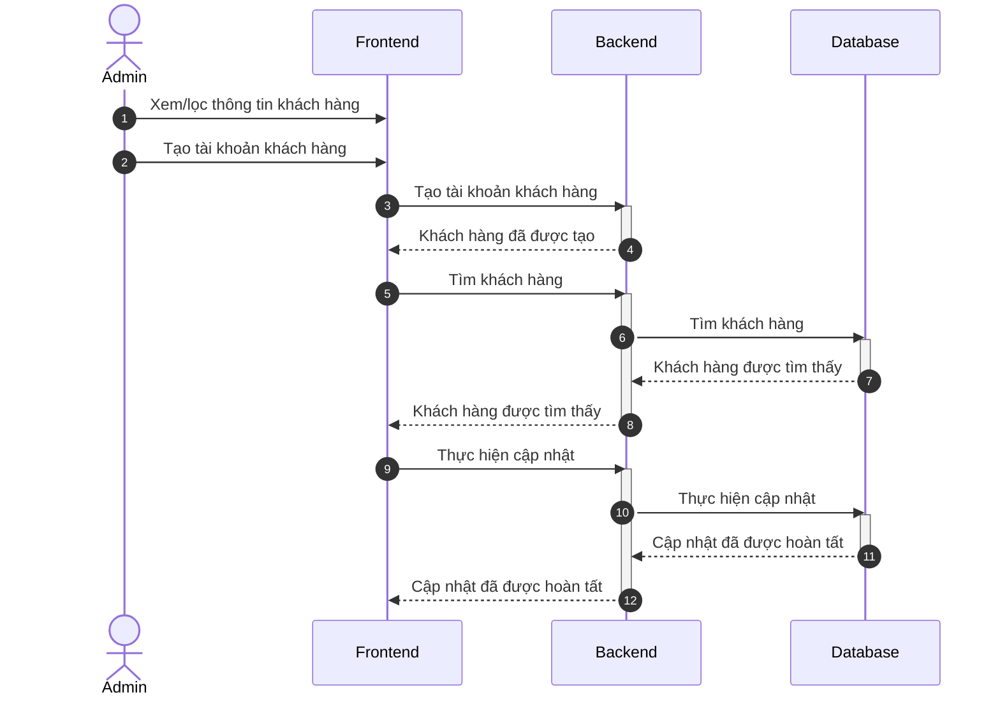
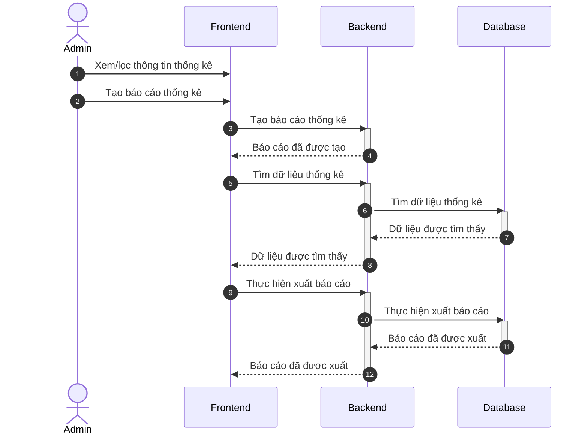
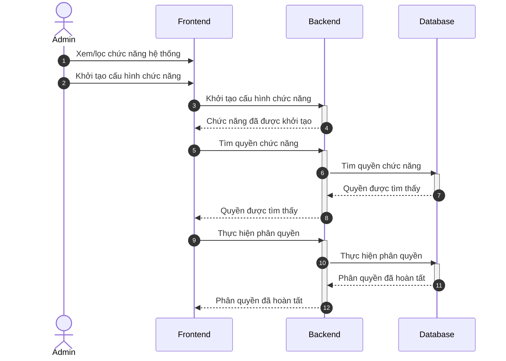

# TỔNG HỢP TẤT CẢ MERMAID SEQUENCE DIAGRAMS - DỰ ÁN AEROSTRIDE

Tài liệu này chứa mã nguồn **Mermaid Sequence Diagram** của tất cả 10 phân hệ/màn hình chức năng trong dự án. Bạn có thể copy trực tiếp vào Draw.io (chọn *Insert > Advanced > Mermaid*) hoặc xem trực tiếp bằng Markdown Preview.

---

## 1. Quản Lý Sản Phẩm

---

## 2. Bán Hàng Tại Quầy (POS)

---

## 3. Quản Lý Thuộc Tính Sản Phẩm

---

## 4. Quản Lý Hóa Đơn

---

## 5. Quản Lý Phiếu Giảm Giá

---

## 6. Quản Lý Đợt Giảm Giá

---

## 7. Quản Lý Nhân Viên

---

## 8. Quản Lý Khách Hàng

---

## 9. Thống Kê

---

## 10. Đặc Tả Chức Năng

