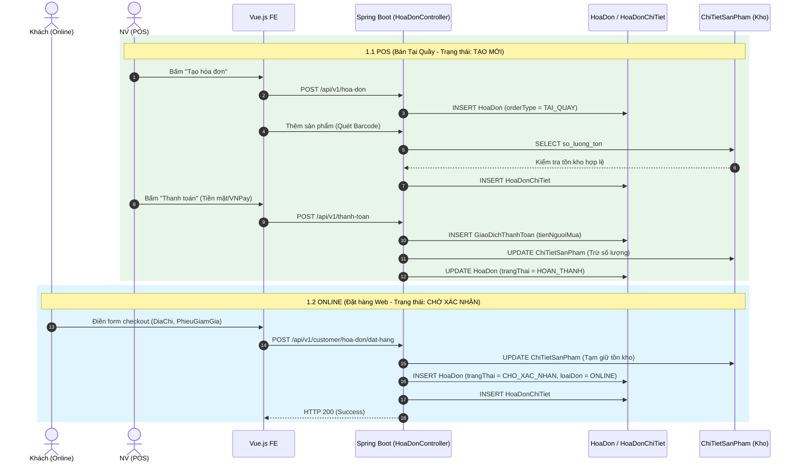
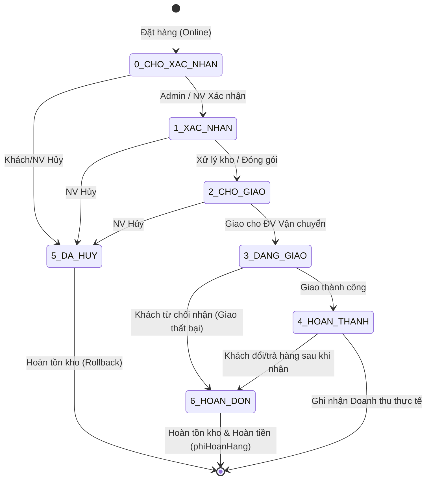
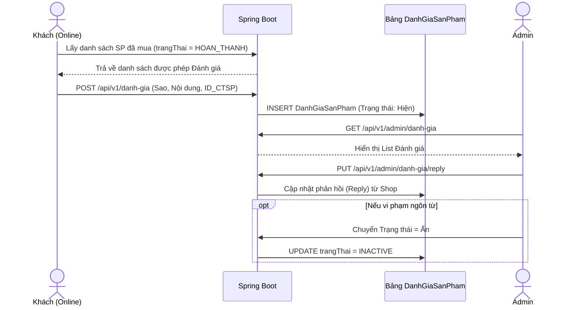
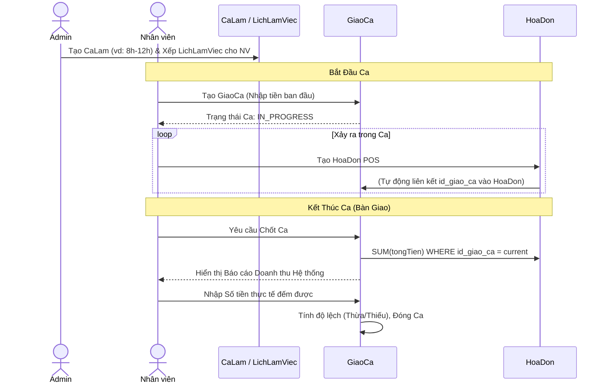
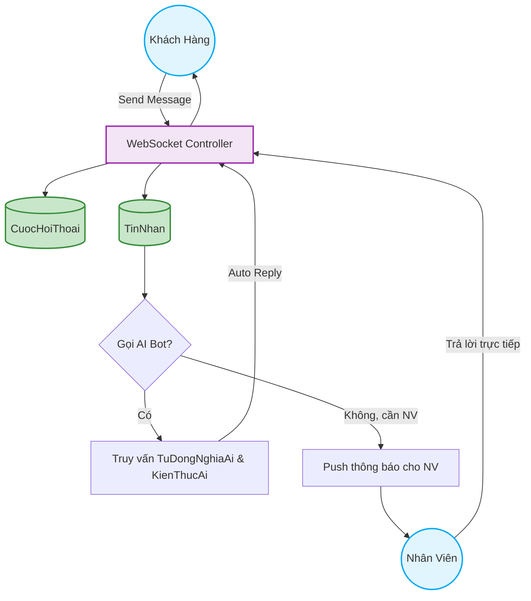

# Sơ đồ Luồng Nghiệp vụ Chi tiết (Cấp độ Kỹ thuật / Database)

Tài liệu này trình bày các luồng nghiệp vụ **sâu sát với mã nguồn thực tế** (các bảng Entity, Logic Backend, State Machine) của dự án AeroStride. Nó dành cho Lập trình viên, Quản trị viên và người cần nắm vững logic kỹ thuật cốt lõi.

---

## 1. Luồng Bán Hàng Tại Quầy (POS) & Bán Hàng Online

Luồng xử lý đơn hàng tương tác trực tiếp với các thực thể: `HoaDon`, `HoaDonChiTiet`, `GiaoDichThanhToan`, và `ChiTietSanPham`.



---

## 2. Máy Trạng Thái Hóa Đơn & Vận Chuyển (Order State Machine)

Bám sát logic trong enum `OrderStatus.java`. Bất cứ sự thay đổi nào cũng ghi lại nhật ký vào bảng `LichSuTrangThaiHoaDon`.


*(Lưu ý: Hóa đơn POS (Tại quầy) đi thẳng tới trạng thái `4_HOAN_THANH`).*

---

## 3. Luồng Quản Lý Khách Hàng (Customer Lifecycle)

Logic bám sát vào bảng `KhachHang` và `DiaChi`. Khách hàng có thể được gán `PhieuGiamGiaCaNhan`.

```mermaid
flowchart TD
    classDef action fill:#bbdefb,stroke:#1976d2,stroke-width:2px;
    classDef state fill:#ffe082,stroke:#ffa000,stroke-width:2px;
    classDef db fill:#c8e6c9,stroke:#388e3c,stroke-width:2px;

    Start((Khởi tạo)) --> Register[Khách hàng Đăng ký (Web)]:::action
    Start --> POS_Add[Nhân viên thêm Khách (POS)]:::action
    
    Register --> BE_Auth[Tạo Account & Hash Password]:::action
    POS_Add --> BE_Auth
    
    BE_Auth --> DB_KH[(Bảng KhachHang)]:::db
    
    DB_KH --> Login[Đăng nhập sinh RefreshToken]:::action
    Login --> Profile[Xem Profile Hồ sơ]:::state
    
    Profile --> DiaChi[Quản lý Sổ Địa Chỉ]:::action
    DiaChi --> DB_DC[(Bảng DiaChi)]:::db
    DB_DC --> MặcĐịnh[Set 1 Địa chỉ Default để Checkout]
    
    Profile --> Voucher[Xem Ví Voucher]:::action
    Voucher --> DB_PGG[(Bảng PhieuGiamGiaCaNhan)]:::db
```

---

## 4. Kiến Trúc Sản Phẩm & Biến Thể (Product & SKU Architecture)

Ánh xạ logic từ các bảng `ThuongHieu`, `ChatLieu`, `KichThuoc`, `MauSac` cấu thành nên `SanPham` và cuối cùng là `ChiTietSanPham` (SKU thực tế đem bán).

```mermaid
flowchart TD
    classDef config fill:#e1bee7,stroke:#8e24aa,stroke-width:2px;
    classDef main fill:#ffcc80,stroke:#f57c00,stroke-width:2px;
    classDef sku fill:#a5d6a7,stroke:#2e7d32,stroke-width:2px;
    classDef asset fill:#b3e5fc,stroke:#0288d1,stroke-width:2px;

    T1(ThuongHieu):::config --> SP[SanPham (Root Product)]:::main
    T2(ChatLieu):::config --> SP
    T3(DeGiay / CoGiay):::config --> SP
    T4(MucDichChay):::config --> SP
    
    SP -->|+ KichThuoc + MauSac| CTSP[ChiTietSanPham (SKU Biến Thể)]:::sku
    
    CTSP --> Kho[so_luong_ton = int]
    CTSP --> Gia[gia_ban = BigDecimal]
    CTSP --> Barcode[Ma_vach / QR Code]
    
    CTSP --> Upload[Upload Ảnh]
    Upload --> Cloudinary((Cloudinary API)):::asset
    Cloudinary --> DB_Anh[(Bảng AnhChiTietSanPham)]:::asset
```

---

## 5. Luồng Đánh Giá Sản Phẩm (Reviews & Ratings)

Quá trình tương tác trên bảng `DanhGiaSanPham`.



---

## 6. Luồng Khuyến Mãi (Promotions - Campaigns vs Vouchers)

Chi tiết cách `DotGiamGia` (Campaigns) tác động trực tiếp lên giá sản phẩm, và `PhieuGiamGia` (Vouchers) tác động lên tổng hóa đơn lúc thanh toán.

```mermaid
flowchart TD
    classDef admin fill:#e1bee7,stroke:#8e24aa,stroke-width:2px;
    classDef logic fill:#fff8e1,stroke:#fbc02d,stroke-width:2px;
    classDef db fill:#c8e6c9,stroke:#388e3c,stroke-width:2px;
    classDef client fill:#e1f5fe,stroke:#03a9f4,stroke-width:2px;

    Admin((Quản trị viên)):::admin
    
    %% Nhánh Đợt Giảm Giá (Campaign)
    subgraph Campaign [1. Đợt Giảm Giá (Giảm trực tiếp Giá Sản Phẩm)]
        Admin -->|Tạo mới| DGG[DotGiamGia \n- loaiGiamGia %, VND\n- soTienGiam]:::db
        DGG -->|Áp dụng cho| CDGG[ChiTietDotGiamGia \nMapping]:::db
        CDGG -->|Liên kết tới| CTSP[ChiTietSanPham Biến thể]:::db
        CTSP -->|Logic Tính toán| GiaBanMoi[Giá Bán Mới = Giá Gốc - Giảm Giá]:::logic
    end
    
    %% Nhánh Phiếu Giảm Giá (Voucher)
    subgraph Voucher [2. Phiếu Giảm Giá (Giảm Tổng Hóa Đơn)]
        Admin -->|Tạo mới| PGG[PhieuGiamGia \n- hinhThuc Công khai/Cá nhân\n- phanTram/soTienGiam\n- donHangToiThieu, giamToiDa]:::db
        PGG --> CheckLoai{Hình Thức?}
        CheckLoai -->|Cá Nhân| PGG_CN[PhieuGiamGiaCaNhan \nGắn ID Khách Hàng]:::db
        CheckLoai -->|Công Khai| Public[Mã Code Public]:::logic
    end

    %% Thanh Toán (Checkout)
    KH((Khách hàng / POS)):::client -->|Checkout| HoaDon[(Hóa Đơn)]:::db
    GiaBanMoi -->|Thêm vào Giỏ| HoaDon
    Public -.->|Nhập Code| HoaDon
    PGG_CN -.->|Chọn từ Ví| HoaDon
    
    HoaDon --> Validation[Kiểm tra Hợp lệ: \n- Nằm trong Ngày BĐ/KT \n- Đạt Đơn Hàng Tối Thiểu \n- Còn Lượt soLuong]:::logic
    Validation -->|Hợp lệ| TongTien[Tính Tổng Tiền = SUM Giá Bán Mới - Tiền Giảm Voucher]:::logic
    Validation -->|Sai ĐK| Err[Báo Lỗi]:::logic
```

---

## 7. Luồng Ca Làm Việc & Giao Ca (Shift Handover)

Bám sát logic bảng `CaLam`, `LichLamViec`, và `GiaoCa` để quản trị dòng tiền vật lý tại cửa hàng.



---

## 8. Luồng Trò Chuyện Trực Tuyến & AI (Live Chat & AI Bot)

Kết hợp bảng `CuocHoiThoai`, `TinNhan` và hệ thống WebSocket + AI Bot (`KienThucAi`, `TuDongNghiaAi`).



---

## 9. Luồng Quản Lý Tệp File & Cloudinary (Assets)

Quá trình tải lên hình ảnh từ trình duyệt đi thẳng tới Cloudinary hoặc qua Backend proxy.

```mermaid
flowchart LR
    FE[Vue.js FE / Admin] -->|Multipart/form-data| BE_Upload[FileController / Upload Service]
    BE_Upload -->|Rest API| Cloudinary[(Cloudinary API)]
    Cloudinary -->|Secure URL (CDN)| BE_Upload
    BE_Upload --> DB[(MySQL)]
    DB --> |Trả URL về| FE
```

---

## 10. Luồng Thống Kê / Báo Cáo (Dashboard & Analytics)

Truy xuất dữ liệu tổng hợp dựa trên trạng thái `HOAN_THANH` của đơn hàng, kết xuất ra Dashboard biểu đồ cho Admin.

```mermaid
flowchart TD
    classDef db fill:#c8e6c9,stroke:#388e3c,stroke-width:2px;
    classDef logic fill:#fff8e1,stroke:#fbc02d,stroke-width:2px;
    
    DB_HD[(HoaDon)]:::db
    DB_HDCT[(HoaDonChiTiet)]:::db
    DB_KH[(KhachHang)]:::db
    
    DB_HD --> |WHERE trangThai=HOAN_THANH| ThongKe[ThongKeService]:::logic
    DB_HDCT --> |JOIN HoaDon| ThongKe
    DB_KH --> |Đếm Account Mới| ThongKe
    
    ThongKe --> |Data JSON (Date/Value)| FE_Chart[ThongKe.vue (ApexCharts / ChartJS)]
    
    FE_Chart --> C1[Biểu đồ Doanh Thu / Lợi Nhuận]
    FE_Chart --> C2[Biểu đồ SP Bán Chạy (Từ HDCT)]
    FE_Chart --> C3[Tỉ lệ Hủy/Thành công]
```
